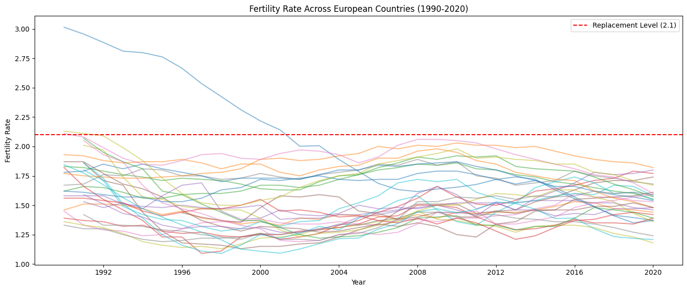
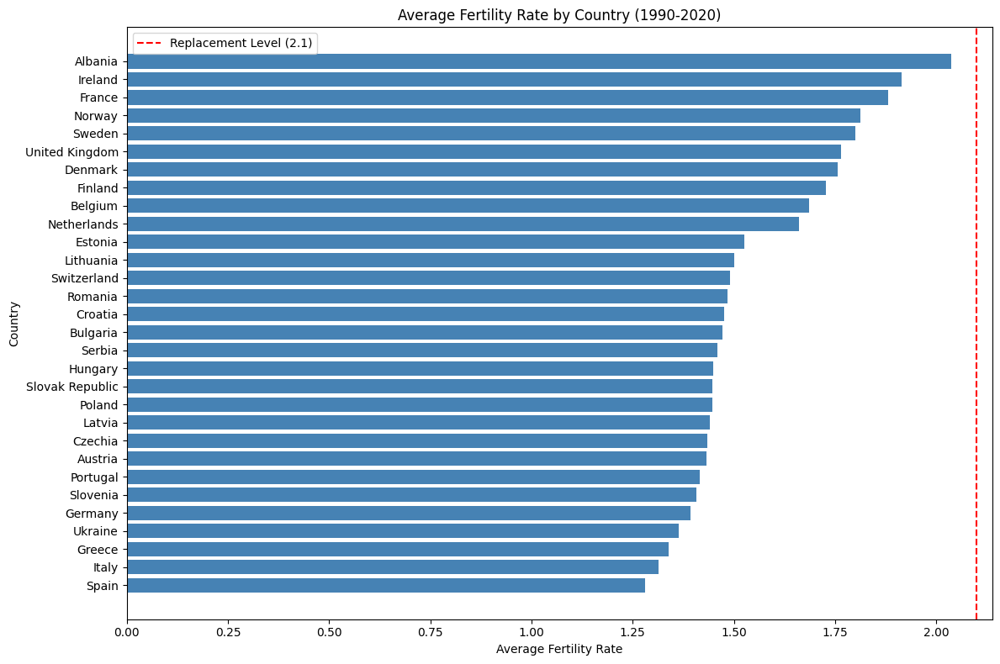
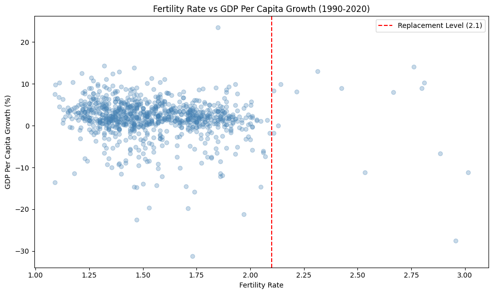
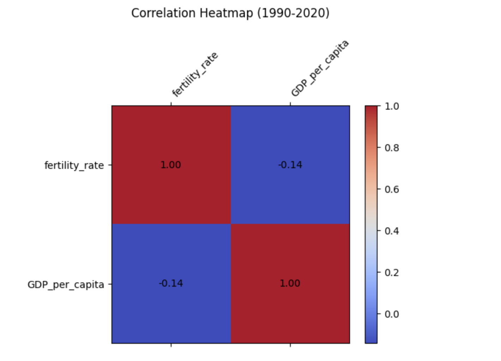
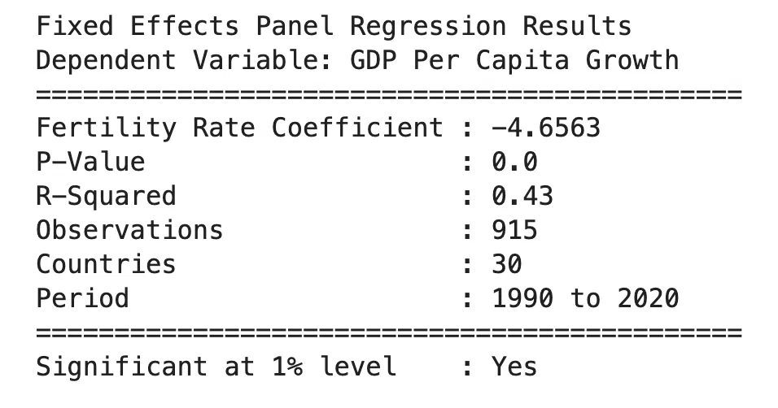

# Demographic Decline and Economic Growth Across Europe Using Panel Data Analysis

## Overview
This project started as an econometric study during university.
It examines whether declining birth rates across Europe are negatively affecting economic growth, 
using panel data across 30 European countries from 1990 to 2020.

The objective was to quantify the relationship between fertility rate and GDP per capita growth across Europe using a fixed effects panel data model, controlling for country specific characteristics and shared time trends. Fertility rate was expected to show a positive relationship with GDP growth, 
with countries sustaining higher birth rates performing better economically over time.

&nbsp;

## What the Data Revealed
The results were more direct than anticipated. Fertility rate had a significant positive effect on GDP per capita growth. 
The increase of one unit in fertility rate was associated with a 4.66% increase in GDP per capita growth, after controlling for all country and year effects. 
The relationship was more immediate and economically meaningful than expected.

The model also captured sharp GDP contractions in 1991, 1992, 2009 and 2020, corresponding to post-Soviet transition, the global financial crisis and COVID. These shocks affected low fertility countries disproportionately more, reinforcing the argument that economies with weaker demographic foundations are more exposed to external shocks.

&nbsp;

## Dataset
Data was sourced from the World Bank Open Data API using the wbdata Python library, 
covering 30 European countries from 1990 to 2020 across fertility rate and GDP per capita growth. 

**Tools and Libraries:** Python, Jupyter Notebook, pandas, numpy, wbdata, statsmodels, matplotlib

&nbsp;

## Methodology

**1) Data Collection:**
Raw data was pulled directly from the World Bank Open Data API using the wbdata Python library. 
Fertility rate and GDP per capita growth were extracted across 30 European countries, covering the period 1990 to 2020. 
The data was returned in a multi-index panel format with country and year as the two dimensions.

**2) Data Cleaning:**
The dataset was inspected for missing values and structural issues before any analysis was carried out. 
Variables with significant data gaps were removed to preserve the integrity of the panel. 
Remaining missing values were dropped to produce a balanced dataset of 915 observations across 30 countries.

**3) Exploratory Data Analysis:**
A full visual exploration was carried out before modelling. This included a fertility rate trend chart across all 30 countries 
with the replacement level marked, a country level bar chart ranking average fertility rates, a scatter plot of fertility rate against GDP per capita growth, and a correlation heatmap. These visuals were used to identify relationships, detect outliers and build the analytical narrative ahead of the regression.

**4) Panel Data Modelling:**
A fixed effects OLS regression was specified using country and year dummies to control for unobserved country specific characteristics and common time trends. This approach isolates the within-country variation in fertility rate and its effect on GDP per capita growth, removing confounding factors that would otherwise bias the estimate.

**5) Results Interpretation:** 
The fertility rate coefficient, p-value, R-squared and model diagnostics were evaluated. Serial correlation was identified in the 
residuals via the Durbin-Watson statistic and is noted as a limitation. The coefficient was interpreted in the context of the fixed effects 
specification rather than as a raw correlation.

&nbsp;

## Exploratory Data Analysis

&nbsp;

This chart shows the near universal decline in fertility rates across Europe. 
The 2.1 replacement level is the point at which a population sustains itself without migration was defined by the United Nations and World Bank. 
By 1990 almost every country had already fallen below this threshold and rates have remained there ever since.

&nbsp;

Albania comes closest to the replacement level, with every other country falling below the 2.1 threshold over the full period. 
Italy and Spain sit at the bottom, well below the level needed to sustain population without migration.

&nbsp;

The scatter shows most observations clustered below the 2.1 replacement line. 
The extreme GDP outliers correspond to post-Soviet transition years and the 2008 financial crisis, both of which are controlled for in the model.

&nbsp;

The raw correlation between fertility rate and GDP per capita growth is -0.14, weak at the surface level but expected given how much country 
and time variation is present in the raw data. The fixed effects model strips this out and reveals the underlying relationship.

&nbsp;

## Outcomes

A one unit increase in fertility rate is associated with a 4.66% increase in GDP per capita growth, 
after controlling for country and year fixed effects. The result is statistically significant at the 1% level, meaning the relationship 
is unlikely to be driven by chance. The R-squared of 0.43 indicates the model explains 43% of the variation in GDP growth across the panel, 
which is a strong result for macroeconomic data of this type. The model was estimated across 915 observations covering 30 countries over a 30 year period.

&nbsp;

## Limitations

**1) Lag effects not modelled:** 
Birth rate changes do not affect the economy immediately. A child born today does not enter the workforce for roughly 20 years, meaning the true economic consequences of fertility decline take decades to materialise. By using fertility rate and GDP growth measured in the same year, this model likely understates the real long run relationship. A stronger specification would use fertility rate lagged by 10 to 20 years, allowing the model to capture the delayed channel through which demographics feed into growth.

**2) Autocorrelation:** 
The Durbin-Watson statistic for the GDP model came in at 1.114, below the ideal value of 2, indicating that the residuals are correlated across time within each country. This means the standard errors produced by the model may be too small, which can make results appear more statistically significant than they truly are. Using robust standard errors clustered at the country level would correct for this and produce more reliable inference.

**3) Single analysis:** 
Fertility rate is treated here as the primary demographic variable, but it does not operate in isolation. 
Immigration can offset population decline, shifts in mortality rates change the age structure independently of births, and labour force participation shapes how demographic changes translate into output. None of these are controlled for, meaning the fertility rate coefficient may be absorbing some of their influence.

**4) No comparison against other indicators:** 
This analysis focuses on whether fertility rate affects GDP growth, but it does not test how fertility rate ranks as a predictor relative to other economic drivers such as unemployment, inflation, net wages or investment. A more complete study would include multiple indicators in a single model and assess whether birth rate remains a significant explanatory variable once those factors are controlled for. That comparison would provide much stronger evidence for the central argument that demographic decline is one of the most important structural risks facing European economies.
